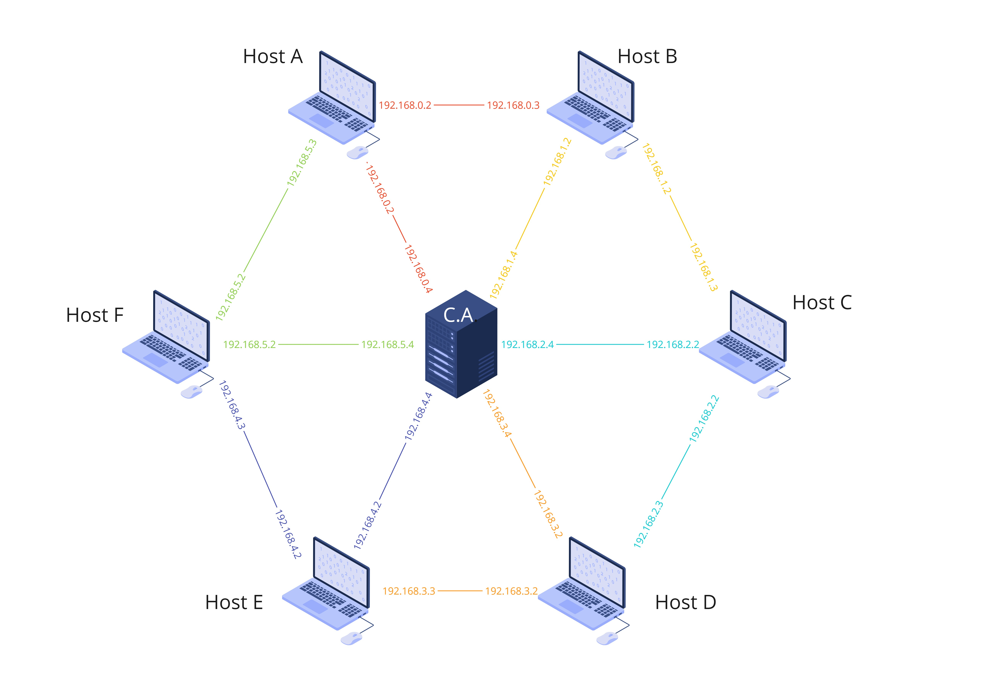

# Ring-Network-With-Docker-Containers
Rede de conteineres docker com topologia em anel. Projeto de Infraestrutura de Comunicação do curso de Ciência da Computação da UFPE

## Instruções de uso
1. Clone o repositório;
2. Abra um terminal no diretorio raiz do projeto e execute o comando `docker compose up -d`. Serão criados os containers e as redes, e cada container vai lançar um bash em modo desanexado;
3. Para anexar ao terminal de um nó, utilize o comando `docker attach ring-network-with-docker-containers-host-{L}-1` substitua {L} pela letra do nó (A, B, C, ..., F) para conectar-se a ele;
4. Anexe o terminal do primeiro nó, digite o comando `python host.py`, e os sockets do nó irão fazer bind nos IPs e porta, (NÃO DIGITE ENTER NEM FECHE O TERMINAL);
5. Para cada um dos outros nós, abra um novo terminal (`Ctr+Shift+'` no Vscode) e repita o passo 4;
7. Em outro terminal, anexe ao terminal da autoridade certificadora com o comando `docker attach ring-network-with-docker-containers-auth-1`;
8. Digite o comando `python auth.py`, e os sockets da autoriadade farão bind nos IPs e porta;
9. Volte para os terminais dos nós e digite enter duas vezes para cada um dos terminais;
10. Pront! Agora você pode usar os terminais livremente. Cada terminal é um nó, capaz de enviar e receber mensagens.

### Observação
Em caso de `OS error`, desfaça a rede e os nós com `docker compose down` espere alguns minutos e crie novamente com `docker compose up -d`

## Docker
Tanto os containers quanto as redes são gerados através do arquivo [compose.yaml](./compose.yaml). Não é necessário realizar builds por comando para gerar as imagens, pois desde que haja conexão com a internet, o compose busca as imagens de um repositório remoto e as instala, builds locais tem privilégio sobre as imagens salvas em repositório, porque o compose busca pela tag `latest`.

### Containers
Foram usadas duas imagens baseadas em python:3.10-alpine. uma para os [nós da rede](https://hub.docker.com/r/gust4vossm/hosts), e outra para a [autoridade certificadora](https://hub.docker.com/r/gust4vossm/auth). Ambas as imagens estão disponíveis no repositorio Docker Hub.

### Redes Docker
A rede utilizadé é a rede 192.168.0/16, possuindo 6 subredes para a topologia em anel (route-1, route-2 ... route-6) representando as conexões entre os nós. Cada rota possúi um par de hosts mais a autoridade certificadora, que [está presente em todas as redes](./compose.yaml#L8-L20). Para a máscara das subredes usou se /24 por simplicidade, já que o terceiro e o quarto octeto são usados para subnetid e hostid, respectivamente, facilitando a leitura. A rota n tem o endereço de subrede 192.168.{n-1}.0/24

```yaml
networks: 
    route-1:
        internal: true
        ipam:
            config:
            -   subnet: 192.168.0.0/24
    route-2:
        internal: true
        ipam:
            config:
            -   subnet: 192.168.1.0/24

# (...)

    route-6:
        internal: true
        ipam:
            config:
            -   subnet: 192.168.5.0/24
```
Desta forma, cada nó possui duas interfaces (e portanto, [dois IPs](./compose.yaml#L27#L31)) e só consegue se comunicar com duas subredes, cada qual contendo um nó vizinho e a autoridade certificadora. Já a autoridade certificadora possúi [6 interfaces](./compose.yaml#L8-L20), comunicando se com todos os nós. Para simplificar o entendimento, a autoridade sempre usa 4 como hostid em todas os seus ips e os nós sempre usam 2 e 3 respectivamente, como hostids nos ips de interface anterior e posterior.



## Hosts (Nós)

Os hosts são executados no arquivo host.py. A variável de ambiente `$ID` permite que todos os nós rodem usando o mesmo arquivo. O `$ID` é usado para [atribuir os ips proceduralmente](./Hosts/host.py#L58-L62) e fazer a [escolha](./Hosts/app.py#L23-L35) das [tabelas de encaminhamento](./README.md#tabelas-de-encaminhamento):
```python
# Escolha das tabelas baseado na variavel de ambiente
match self.host:
    case 1:
        self.tabela = tabela_1
    case 2:
        self.tabela = tabela_2
    case 3:
        self.tabela = tabela_3
    case 4:
        self.tabela = tabela_4      
    case 5:
        self.tabela = tabela_5
    case 6:
        self.tabela = tabela_6
```
### Geração procedural dos IPs
Os IPs são atribuidos para as interfaces seguinto um conjunto de regras:
- As interfaces da autoridade certificadora possuem IP da forma 192.168.x.4;
- As interfaces dos hosts na direção horária são sempre da forma 192.168.x.2;
- As interfaces dos hosts na direção anti-horária são sempre da forma 192.168.x.3;
- A subnetid sempre usa o indice da rota -1.

Conhecendo essas informações e usando aritimética modular, é possível gerar os IPs dos hosts proceduralmente:
```python
ip = [[int,int],[int, int]] # matrix 2x2
ip[SRC][PREV] = f"{prefix}.{(id-2)%6}.3"
ip[SRC][NEXT] = f"{prefix}.{(id-1)%6}.2"
ip[DST][PREV] = f"{prefix}.{(id-2)%6}.2"
ip[DST][NEXT] = f"{prefix}.{(id-1)%6}.3"
```


### Encaminhamento
			Envio e recebimento de mensagens

	
O envio e recebimento de mensagens segue algumas etapas até ser concluído, mostrarei um caso hipotético para exemplificar. Vamos supor que o host B  quer se comunicar com o host A. Para isso, ele pedirá à Autoridade Certificadora a chave pública de A, que vai responder a mandando para B. Após isso, o host B gera uma chave simétrica aleatória e criptografa a mensagem com ela. Além disso, o host B vai criptografar novamente, desta vez com a chave pública de A. Com isso, B encaminha a mensagem para A, que, após receber, descriptografa usando uma chave privada. O resultado disso vai ser uma mensagem e uma chave, que A vai usar para descriptografar de novo, finalmente obtendo a mensagem.
### Tabelas de Encaminhamento

Tabela de roteamento 
 Para a criação da tabela de roteamento, criamos os endereços de forma procedural, utilizando aritmética modular. Com isso, definimos os endereços de forma estática no compose.yaml para cada um dos hosts.
	A partir disso, foram geradas 6 tabelas, uma para cada host. Nelas, está descrita a ação que o host deve tomar para cada possibilidade de IP. Os valores 1 e 0 descrevem para qual interface a mensagem deve sair, sendo o valor 1 para o vizinho à direita e o valor 0 para o vizinho à esquerda.
	Logo, quando um segmento chega em um host, o host vai checar se o segmento é endereçado para ele, caso não seja, a tabela de roteamento vai ser conferida para decidir o local de encaminhamento.
	

